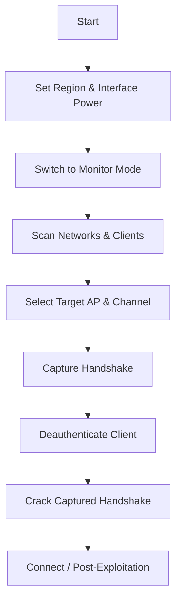

# Wi-Fi Penetration Testing Basics

> **Purpose:** A practical, step-by-step reference for Wi-Fi reconnaissance, capture, and cracking workflows.  
> **Audience:** Pentesters and students performing Wi-Fi assessments in controlled environments.

---

## Overview Workflow



---

## 1. Interfaces and Interface Modes

### Concept: Preparing the Wireless Interface

Before scanning or attacking, configure your wireless card to the correct regulatory domain and mode.

#### **Set Region and Transmit Power**

```bash
sudo iw reg set US                 # Set region to United States (regulatory domain)
sudo ifconfig wlan0 down           # Bring interface down before changes
sudo iwconfig wlan0 txpower 30     # Set transmit power to 30 dBm (max for many adapters)
sudo ifconfig wlan0 up             # Bring interface back up
```

**Breakdown:**

- `iw reg set US`: tells the kernel which country’s frequency/power rules to obey.
    
- `ifconfig wlan0 down/up`: toggles interface state for applying changes.
    
- `iwconfig wlan0 txpower 30`: sets output power in dBm; higher = longer range.
    

#### **Change Channel or Frequency**

```bash
sudo ifconfig wlan0 down
sudo iwconfig wlan0 channel 64     # Set channel number directly
sudo iwconfig wlan0 freq 5.52G     # Alternative: specify frequency (GHz)
sudo ifconfig wlan0 up
```

**Breakdown:**

- `channel 64` = specific Wi-Fi channel (5GHz band).
    
- `freq 5.52G` = same as channel 64 but frequency-based.
    

#### **Change Interface Mode**

```bash
sudo ifconfig wlan0 down
sudo iwconfig wlan0 mode managed   # Normal client mode
sudo iwconfig wlan0 mode ad-hoc    # Peer-to-peer mesh-like mode
sudo iw dev wlan0 set type mesh    # Explicit mesh type
sudo iw wlan0 set monitor control  # Monitor mode for sniffing
sudo ifconfig wlan0 up
```

**Breakdown:**

- `managed`: connects to APs normally.
    
- `ad-hoc`: creates peer network (no AP).
    
- `mesh`: joins 802.11s mesh networks.
    
- `monitor`: captures packets passively; required for sniffing/attacks.
    

---

## 2. Aircrack-ng Essentials

### Concept: Scanning, Capturing, Injecting, Cracking

#### **Start Monitor Mode with airmon-ng**

```bash
sudo airmon-ng start wlan0             # Creates wlan0mon
sudo airmon-ng start wlan0 11          # On specific channel
```

**Breakdown:**

- `airmon-ng start wlan0`: starts monitor interface.
    
- `11`: limits listening to channel 11 (faster, prevents hopping).
    

#### **Scan Networks**

```bash
sudo airodump-ng wlan0mon
sudo airodump-ng -c 11 wlan0mon        # Specific channel
sudo airodump-ng wlan0mon --band a     # Scan only 5GHz
sudo airodump-ng wlan0mon -w HTB       # Save capture output to HTB-01.cap
```

**Breakdown:**

- `airodump-ng`: captures beacons and client traffic.
    
- `-c 11`: restricts to channel 11.
    
- `--band a`: restricts to 5GHz.
    
- `-w HTB`: saves output for later cracking.
    

#### **Visualize Captures**

```bash
airgraph-ng -i HTB-01.csv -g CAPR -o HTB_CAPR.png
airgraph-ng -i HTB-01.csv -g CPG -o HTB_CPG.png
```

**Breakdown:**

- `CAPR`: Client-AP Relationship graph.
    
- `CPG`: Common Probe Graph (shows probing clients).
    

#### **Test Injection and Deauthenticate Clients**

```bash
sudo aireplay-ng --test wlan0mon
sudo aireplay-ng -0 5 -a 00:14:6C:7A:41:81 -c 00:0F:B5:32:31:31 wlan0mon
```

**Breakdown:**

- `--test`: verifies if adapter can inject packets.
    
- `-0 5`: sends 5 deauth packets.
    
- `-a`: target AP BSSID.
    
- `-c`: client MAC.
    

#### **Decrypt and Crack Captures**

```bash
airdecap-ng -w 1234567890ABCDEF HTB-01.cap     # WEP decryption
aircrack-ng -K HTB.ivs                         # WEP cracking
aircrack-ng HTB.pcap -w /opt/wordlist.txt      # WPA cracking
```

**Breakdown:**

- `airdecap-ng`: decrypts WEP capture.
    
- `-K`: auto-cracks WEP from IVs.
    
- `-w /opt/wordlist.txt`: specify wordlist for WPA handshake cracking.
    

---

## 3. Connection Methods

### Concept: Manual Configuration via wpa_supplicant

#### **WEP**

```bash
network={
   ssid="HackTheBox"
   key_mgmt=NONE
   wep_key0=3C1C3A3BAB
   wep_tx_keyidx=0
}
wpa_supplicant -c wep.conf -i wlan0
```

**Breakdown:**

- `key_mgmt=NONE`: no WPA management.
    
- `wep_key0`: hexadecimal key.
    
- `wpa_supplicant`: connects using config.
    

#### **WPA Personal**

```bash
network={
   ssid="HackMe"
   psk="password123"
}
wpa_supplicant -c wpa.conf -i wlan0
```

**Breakdown:**

- `psk`: pre-shared key.
    
- `wpa.conf`: configuration file.
    

#### **WPA Enterprise**

```bash
network={
   ssid="HTB-Corp"
   key_mgmt=WPA-EAP
   identity="HTB\\Administrator"
   password="Admin@123"
}
wpa_supplicant -c wpa_enterprise.conf -i wlan0
```

**Breakdown:**

- `key_mgmt=WPA-EAP`: enterprise auth.
    
- `identity`: username domain.
    
- `password`: user password.
    

---

## 4. Basic Control Bypass

### Concept: Hidden SSID Discovery and MAC Spoofing

#### **Hidden SSID Bruteforce**

```bash
mdk3 wlan0mon p -b u -c 1 -t A2:FF:31:2C:B1:C4   # All possible SSID values
mdk3 wlan0mon p -f /opt/wordlist.txt -t D2:A3:32:13:29:D5   # Wordlist-based
```

**Breakdown:**

- `p`: probe mode.
    
- `-b u`: brute-force all.
    
- `-c 1`: channel.
    
- `-t`: target AP BSSID.
    

#### **MAC Spoofing**

```bash
sudo airmon-ng stop wlan0mon
sudo macchanger wlan0 -m 3E:48:72:B7:62:2A
sudo ifconfig wlan0 up
```

**Breakdown:**

- `airmon-ng stop`: restore managed mode.
    
- `macchanger -m`: set custom MAC.
    
- `ifconfig up`: re-enable interface.
    

---

## 5. Common Scenarios

|Phase|Action|Command|
|---|---|---|
|Recon|Scan all nearby networks|`sudo airodump-ng wlan0mon`|
|Target lock|Focus on AP channel|`sudo airodump-ng -c 6 wlan0mon -w capture`|
|Capture|Save handshake|`sudo airodump-ng -w WPA wlan0mon`|
|Attack|Deauth client|`sudo aireplay-ng -0 5 -a <BSSID> -c <CLIENT> wlan0mon`|
|Crack|Use dictionary|`aircrack-ng capture.cap -w /usr/share/wordlists/rockyou.txt`|

---

## 6. Troubleshooting Tips

|Problem|Cause|Fix|
|---|---|---|
|`fixed channel -1`|NetworkManager interference|`sudo airmon-ng check kill`|
|`Device busy`|wlan0 still active|`sudo ifconfig wlan0 down` before mode change|
|`No packets captured`|Wrong channel or adapter issue|Match AP channel; ensure antenna works|
|`No injection support`|Incompatible chipset|Verify with `aireplay-ng --test`|

---

## 7. Cross-tool Reference

|Purpose|Legacy Tool|Modern Alternative|
|---|---|---|
|Enable monitor|`airmon-ng start wlan0`|`iw dev wlan0 set monitor control`|
|Change channel|`iwconfig wlan0 channel 6`|`iw dev wlan0 set channel 6`|
|Scan networks|`airodump-ng wlan0mon`|`iw dev wlan0 scan`|
|Crack WPA|`aircrack-ng`|`hashcat -m 22000`|

---

## 8. Cracking Reference

|Encryption|Capture Type|Cracking Tool|Example|
|---|---|---|---|
|**WEP**|IVs|`aircrack-ng`|`aircrack-ng -K capture.ivs`|
|**WPA/WPA2**|Handshake|`aircrack-ng` / `hashcat`|`aircrack-ng capture.cap -w rockyou.txt`|
|**WPA3 (SAE)**|PMKID|`hashcat`|`hashcat -m 22000 pmkid.hash rockyou.txt`|

---

### Summary

- **Preparation:** Regulatory domain, monitor mode, channel.
- **Reconnaissance:** `airodump-ng` and graphs.
- **Attack:** Deauth or capture handshake.
- **Cracking:** `aircrack-ng` / `hashcat`.
- **Connection:** `wpa_supplicant` with configs.
- **Cleanup:** `airmon-ng stop wlan0mon` and `NetworkManager restart`.